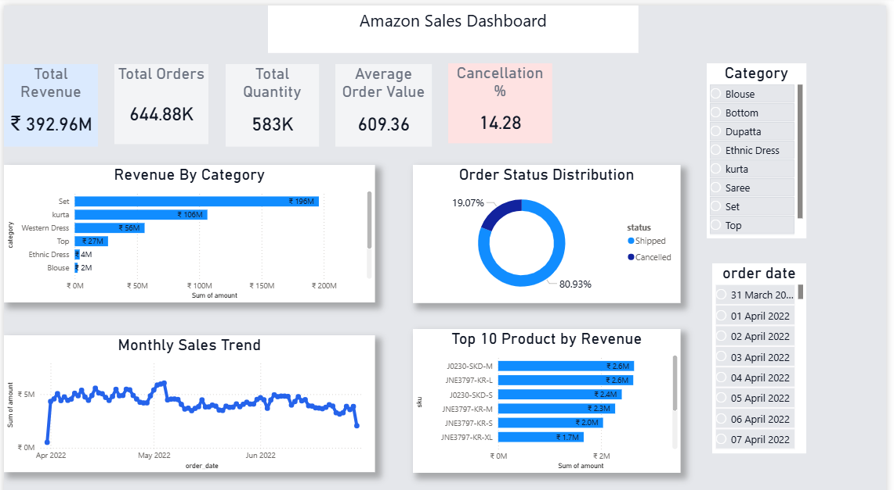

# Amazon Sales Dashboard 📊

## 🔹 Project Overview
This project analyzes Amazon sales data using Power BI and MySQL to generate meaningful business insights.  
The dashboard helps track sales performance, identify trends, and support data-driven decision making.

---

## 🔹 Tools Used
- Power BI (Data Visualization)
- MySQL (Data Storage & Queries)
- Excel / CSV (Dataset)

---

## 🔹 Key Features
- Total Revenue KPI
- Total Orders KPI
- Average Order Value
- Cancellation Rate
- Sales Trend Analysis
- Top Product Categories

---

## 🔹 Dashboard Preview

---

## 🔹 SQL Queries
- Database creation and table structure
- Data analysis using SQL (SUM, GROUP BY, ORDER BY)

📁 Check `amazon_sales.sql`

---

## 🔹 Dataset
Sample dataset is included in this repository.  
Dataset inspired from Amazon sales data available on Kaggle.

---

## 🔹 Insights
- Identified top-performing product categories
- Observed sales trends over time
- Detected patterns in order cancellations

---

## 🔹 Author
Priya Saini
