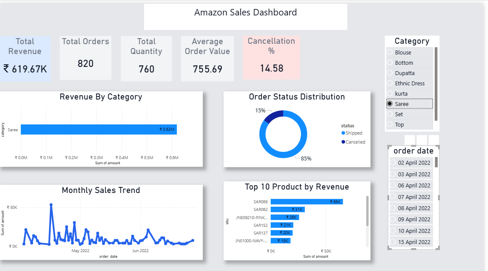

# Amazon Sales Dashboard 📊

## 🔹 Project Overview
This project presents an interactive Amazon Sales Dashboard built using Power BI and MySQL.  
It helps analyze sales performance, identify trends, and generate actionable business insights for better decision-making.

---

## 🔹 Problem Statement
Businesses often struggle to understand large volumes of sales data.  
This dashboard solves that problem by converting raw data into clear and interactive visual insights.

---

## 🔹 Tools & Technologies
- Power BI (Data Visualization)
- MySQL (Database & SQL Queries)
- Excel / CSV (Data Source)

---

## 🔹 Key Features
- Total Revenue KPI
- Total Orders KPI
- Average Order Value
- Cancellation Rate
- Sales Trend Analysis
- Top Product Categories
- City & State-wise Sales Insights

---

## 🔹 Dashboard Preview

### 📊 Main Dashboard

### 📈 Additional View

---

## 🔹 SQL Queries
- Database creation and table structure
- Data analysis using SQL (SUM, GROUP BY, ORDER BY)

📁 File: `amazon_sales.sql`

---

## 🔹 Dataset
Sample dataset included in this repository.  
Dataset inspired from Amazon sales data available on Kaggle.

---

## 🔹 Insights Generated
- Identified top-performing product categories
- Observed seasonal sales trends
- Found patterns in order cancellations
- Analyzed regional performance

---

## 🔹 Project Outcome
The dashboard simplifies complex sales data into meaningful insights, enabling better business decisions and performance tracking.

---

## 🔹 Author
Priya Saini
